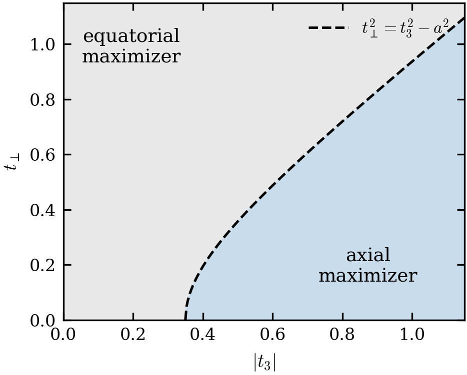

# Two-Qubit Daemonic Ergotropy

Reproducibility package for analytical and numerical calculations of two-qubit daemonic ergotropy.

The repository is organized so that the closed-form calculations, numerical validation, generated data, and plotting steps can be inspected separately. It is intended as a compact research artifact rather than a general-purpose software package.

<p align="center">
  
</p>

## What is reproduced

- closed-form concurrence and visibility calculations for the analytic families studied in the project;
- numerical validation on analytic families, random pure states, and random Hilbert-Schmidt mixed states;
- deterministic figure generation from the stored numerical outputs;
- machine-readable CSV, NPZ, and JSON result files used by the plotting scripts.

## Repository layout

| Path | Purpose |
|---|---|
| `Code/closed_form_daemonic_ergotropy.py` | Closed-form functions for concurrence and visibility calculations |
| `Code/twoqubit_daemonic_ergotropy_numerics.py` | Numerical validation for analytic families and random states |
| `Code/plot_closed_form_figure.py` | Regenerates the closed-form figure and associated CSV outputs |
| `Code/plot_figures.py` | Regenerates the remaining figures from stored results |
| `Code/figure_io.py` | Shared paths, plotting conventions, and deterministic output helpers |
| `Results/` | Generated CSV, NPZ, and JSON outputs |
| `Figures/` | Generated publication figures |

## Environment

The Python dependencies are pinned in `Code/requirements.txt`.

```bash
python3 -m venv .venv
. .venv/bin/activate
python -m pip install -r Code/requirements.txt
```

## Reproduce the calculations

Regenerate the closed-form figure and visibility data:

```bash
python Code/plot_closed_form_figure.py
```

Regenerate the remaining figure files from the stored numerical outputs:

```bash
python Code/plot_figures.py
```

Run the full numerical validation:

```bash
python Code/twoqubit_daemonic_ergotropy_numerics.py
```

The plotting scripts write publication figures to `Figures/`. The numerical scripts keep the intermediate outputs in `Results/` so that the analysis can be inspected without rerunning every calculation.

## Research context

This repository is part of my work on quantum information thermodynamics and resource extraction from correlated quantum systems.

For the broader research context, publications, and current work, see [kangqiaoliu.github.io](https://kangqiaoliu.github.io/).
